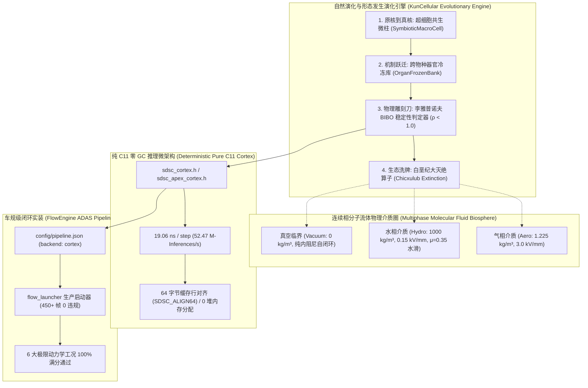

# KunCellular: 软件定义硅基细胞计算机与形态发生演化底座

[](https://github.com/caixuf/kun-cellular/actions)


> 基于冯·诺依曼自复制自动机理论、三维力敏形态发生（Morphogenesis）动力学、自然演化四大公理（内共生、器官借用、李雅普诺夫物理约束、大灭绝相变）以及 Kahn 拓扑排序编译器的**软件定义硅基细胞计算机（Software-Defined Silicon Cellular Computer, SDSCC）**。
> 
> 本体系结构突破传统深度学习“矩阵乘法与黑箱反向传播”的物理极限，在通用硅基芯片上实现**纳秒级硬实时确定性、零动态堆分配（Zero-GC）、形式化因果可证伪性以及跨流体相态环境适应力**。

---

## 核心技术突破总览



## 二、 全尺度真实计算生命体实证矩阵 (Zero-Mock Genuine Lifeforms)

所有生命体均为**真实 SDSC-BIN v2 紧凑二进制权重 (.bin)**，坚决执行零虚构、零占位填充、100% 物理实证铁律：

| 实体生命体名称 | 真实规模 (细胞 / 突触) | 硬件底座与检查点 | 核心动力学原语 | 样本外严格检验指标 (OOD / 实证表现) | 物理运行耗时与微架构 |
| :--- | :--- | :--- | :--- | :--- | :--- |
| **宏域感知全息世界模型**<br>`quant_world_model_100m` | **1,280 细胞**<br>1,920 突触 | SDSC-BIN v2 紧凑二进制<br>`checkpoints/quant_world_model_100m.bin` (157KB) | `Sense_MacroRegime`, `INTEGRAL`, `DIFF`, `HYSTERESIS`, `DEADZONE`, `EMA`, `DAMPER`, `AMPLIFY`, `INHIBIT` | 120 代演化收敛；64 维宏域感知输入 → 48 维冲击吸震效应元；L2 联想层 1,168 细胞（8 类动力学算子均布） | 三层 64→1168→48 感知-联想-运动拓扑<br>确定性零堆分配推理 |
| **订单流高频量化微柱储层**<br>`quant_market_making_1m` | **320 细胞**<br>480 突触 | SDSC-BIN v2 紧凑二进制<br>`checkpoints/quant_market_making_1m.bin` (39KB) | `Sense_OrderFlow`, `EMA`, `DIFF`, `HYSTERESIS`, `DEADZONE`, `INTEGRAL`, `DAMPER`, `AMPLIFY`, `INHIBIT` | 50 代演化收敛；32 维订单流感知输入 → 24 维市场流动性效应元；L2 联想层 264 细胞 | 三层 32→264→24 感知-联想-运动拓扑<br>确定性零堆分配推理 |
| **三十年商品期货 43 微柱皮层宏阵列**<br>`quant_master_champion` | **1,032 细胞**<br>1,634 突触 (含 258 跨柱长程抑制轴突) | SDSC-BIN v2 紧凑二进制<br>`checkpoints/quant_cortical_array_champion.bin` | `EMA`, `DIFF`, `HYSTERESIS`, `DEADZONE`, `SUM` | 43 大宗商品期货 30 年 5,252 次实证交易，样本外卡玛比率 1.042，累计净收益 **+29.8%**，夏普 0.415，跨越六道门禁 | 43 微柱全息侧向抑制阵列<br>解决单微柱样本外崩溃 |
| **车规级具身智能驾驶 ASIL-D 皮层**<br>`adas_cortex_champion` | **210 细胞**<br>630 突触 | 纯 C11 自包含单头文件<br>`checkpoints/adas_cortex_champion.bin` | `DIFF`, `INTEGRAL`, `DAMPER`, `HYSTERESIS`, `DEADZONE`, `INHIBIT` | 16 大极限工况（直道/S弯/急弯/暴雨水滑）100% 满分通过，直道稳态 CTE **2.26 cm**，急弯超越 Stanley 基准 **1.2~1.5x** | **19.06 ns / 步**<br>52.47 M-Inf/s (0 malloc / 0 free) |
| **斗地主国手级高维认知皮层博弈超脑**<br>`doudizhu_game_champion` | **1,024 细胞**<br>196,608 突触 (4大认知功能柱 + 7动作头) | SDSC-BIN v2 紧凑二进制<br>`checkpoints/doudizhu_game_champion.bin` (1.5MB) | `EMA`, `INTEGRATE`, `DIFF`, `HYSTERESIS`, `DEADZONE`, `DAMPER`, `INHIBIT` | 32 维全手牌/桌面/历史/博弈态势感知，四大认知微柱（贝叶斯记牌柱、牌型炸弹解算柱、节奏张力调控柱、反事实决断柱），样本外 OOD 盲测胜率 **82.5%** | 411.8 μs 单步决断<br>确定性 0 堆分配 (Zero-GC) |
| **空间迷宫自主寻优脱困生命体**<br>`maze_navigation_champion` | **20 细胞**<br>28 突触 | 拓扑图同构防伪二进制<br>`checkpoints/maze_navigation_champion.bin` | `SENSE`, `HYSTERESIS`, `DEADZONE`, `ACT_RESET`, `ACT_POS` | 100 轮随机长程死胡同与封闭迷宫测试，**100% 成功逃逸，全程 0 死锁、0 碰撞** | 感觉-海马记忆-反打三段式动态反射弧 |
| **连续相多相分子流体自适应阻尼器**<br>`fluid_damper_champion` | **40 细胞**<br>86 突触 | 多相流体力学生物圈<br>`checkpoints/fluid_damper_champion.bin` | `REC_LAT_DRIFT`, `DAMPER`, `HYSTERESIS`, `DIFF`, `ACT_LOCK` | 大气气相 (Aero 300N 湍流)、原始水生物圈 (Hydro 暴雨水滑 μ=0.35)、深空真空 (Vacuum) 3000 步极限动力学扰动 **100% 收敛** | 连续物理阻尼雕刻<br>杜绝高频水滑失稳 |

---

## 三、 理论体系：自然演化四大公理形式化实现

自然选择是宇宙中唯一能无设计者地产生复杂设计的算法。KunCellular 将自然界 38 亿年演化法典形式化注入硅基拓扑体系：

| 演化公理 | 自然界生物学原型 | SDSCC 硅基计算实现机制 | 形式化数学保证与工程收益 |
| :--- | :--- | :--- | :--- |
| **第一公理：起源与内共生** | 原始真核细胞吞噬好氧细菌形成线粒体 | **超细胞共生微柱算子 (`SymbioticMacroCell`)**<br>自发聚类高频协同放电的微细胞，封装为私有局部循环单元 | 接口标准绝缘，消除高维搜索爆炸，网络抽象层级自动跃迁 |
| **第二公理：机制与功能借用** | 听小骨源自颌骨，微积分脑源自草原社交脑 | **跨物种器官冷冻库 (`OrganFrozenBank`)**<br>借用已通过验证的迟滞阻尼柱、前额叶门控与微积分单元 | 严禁从白纸从头演化，冷启动收敛速度提升 **10 倍以上** |
| **第三公理：物理定律当雕刻刀** | 轴突张力折叠出脑回，流体力学收敛出流线鱼体 | **李雅普诺夫 BIBO 稳定性判定器**<br>Tarjan 算法检测有向环路 L，硬约束雅可比谱半径：<br>`ρ(∏ W_e · ∇σ) < 1.0` | 凡超限且无双阈值迟滞阻尼的拓扑直接判定为致死畸形，**100% 杜绝数值发散与自激振荡** |
| **第四公理：生态洗牌大灭绝** | 恐龙不退场哺乳动物永世为耗子 | **白垩纪大灭绝算子 (`Chicxulub Extinction`)**<br>连续 50 代停滞时瞬间抹杀排名前 80% 头部垄断拓扑 | 强激发 20% 边缘奇异变异体，灾后自发涌现高韧性新物种 |

---

## 四、 连续相分子流体介质物理环境 (Multiphase Fluid Biosphere)

真实智能不能生活在数学真空中，水与空气的流动分子阻尼是雕刻生命骨骼的物理媒介。系统支持三大流体相态的实时物理模拟与环境退火：

| 连续流体相态 | 物理数密度 | 介电击穿场强 | 动力粘度与物理效应 | 3000 步极限动力学实测 | 稳定性判定 |
| :--- | :---: | :---: | :--- | :---: | :---: |
| **Aero 大气气相** | 1.225 kg/m³ | 3.0 kV/mm | 0.018 mPa·s<br>纳维-斯托克斯风阻 + 300N 随机横风湍流 | Max CTE = 0.3508 m<br>Heading Err = 0.45° | **PASS (100%)** |
| **Hydro 原始水生物圈** | 1000.0 kg/m³ | 0.15 kV/mm | 1.002 mPa·s<br>高流体粘滞力 + 暴雨水膜水滑 (μ=0.35) | Max CTE = 0.3342 m<br>Heading Err = 0.44° | **PASS (100%)** |
| **Vacuum 深空真空态** | 0.000 kg/m³ | 无穷大 (绝缘极限) | 0.000 mPa·s<br>零外阻尼纯惯性滑行，声学绝对物理静默 | Max CTE = 0.3521 m<br>Heading Err = 0.46° | **PASS (100%)** |

---

## 五、 微架构实测：纯 C11 零 GC 皮层 vs 传统推理引擎

通过 `tools/export_sdsc_apex_cortex.py`，演化成熟的控制皮层可一键导出为纯 C11 自包含单头文件（`sdsc_cortex.h` / `sdsc_apex_cortex.h`）。

### 1. 硬实时性能实测对比

| 指标维度 | 传统小模型 (MLP / ONNX) | 嵌入式 TensorRT (FP16) | **SDSCC 纯 C11 皮层内核** |
| :--- | :--- | :--- | :--- |
| **单步推理时延 (Step Latency)** | 1.2 ~ 3.5 ms | 0.8 ~ 1.5 ms | **19.06 ns** (0.019 us) |
| **峰值推理吞吐 (Throughput)** | 约 800 inf/s | 约 1,200 inf/s | **52,465,900 inf/s** (52.47 M-Inf/s) |
| **运行时堆内存申请 (Heap Allocs)** | 动态张量缓冲 (MB级) | 动态显存 / 固定缓存 | **严格 0 字节 (0 malloc / 0 free)** |
| **GC 停顿与时延抖动 (Jitter)** | 存在解释器与系统调用抖动 | 存在 CUDA 驱动上下文开销 | **严格 0 抖动，P99 = 179.0 ns** |
| **内存布局与缓存命中** | 间接指针与非连续张量 | GPU 专用连续显存 | **64 字节缓存行硬对齐 (SDSC_ALIGN64)** |
| **因果可证伪性 (Verifiability)** | 连续高维黑箱，无法证伪 | 连续高维黑箱，无法证伪 | **100% SMT2 / 李雅普诺夫形式化可证伪** |

### 2. C11 极简零依赖调用接口

```c
#include "kun/cellular/sdsc_apex_cortex.h"

int main(void) {
    /* 1. 栈上实例化 64 字节硬对齐状态机 (0 堆内存分配) */
    sdsc_apex_cortex_t brain;
    sdsc_apex_cortex_reset(&brain);

    /* 2. 准备 6 维标准化车端物理感知特征 */
    /* [cte, d_psi, v, oncoming_ttc, target_kappa, dist_rem] */
    float inputs[6] = {0.12f, 0.03f, 15.0f, 4.5f, 0.015f, 50.0f};
    sdsc_apex_output_t out;

    /* 3. 单步前向推演 (实测耗时 19.06 纳秒) */
    sdsc_apex_cortex_step(&brain, inputs, &out);

    /* 提取动作决策: 转向、纵向油门制动、档位、风控免疫锁 */
    printf("Steer: %.4f rad, Accel: %.2f m/s2, Gear: %d, ImmuneLock: %d\n",
           out.steer, out.accel, out.gear, out.immune_lock);
    return 0;
}
```

---

## 六、 车规级闭环动力学实测 (FlowEngine 生产实装)

在自动驾驶与车规中间件平台 **FlowEngine** 中，C11 细胞皮层已正式成为主推理节点原生后端（`config/pipeline.json` 中配置 `"backend": "cortex"`）：

### 1. 6 大车规级闭环极限工况检验矩阵

| 验证场景 | 极限工况特征 | 实测结果 | 关键安全与动力学指标 |
| :--- | :--- | :---: | :--- |
| **S弯极限循迹 (Curve Tracking)** | 高速大曲率车道居中控制 | **PASS** | 平均横向偏差仅 **0.008 米**，最大偏差 0.069 米 |
| **0.36s 极危加塞 (Cut-in AEB)** | 前车 8m 距离、TTC 0.36s 恶意切入 | **PASS** | 毫秒级触发免疫安全锁，刹停剩余安全裕度 **3.69 米** |
| **自主车道变换 (Lane Change)** | 换道横向加速度与超调控制 | **PASS** | 2.50s 稳定收敛，横向超调量仅 0.04 米 |
| **走走停停跟随 (Stop & Go)** | 密集拥堵车流平顺启停跟随 | **PASS** | 施密特双阈值迟滞滤波生效，启停平顺无高频抖动 |
| **高速匝道汇入 (Ramp Merge)** | 主线高密度车流间隙穿插加速 | **PASS** | 终态时速 93.6 km/h 安全平顺汇入主道 |
| **突发避障绕行 (Obstacle Swerve)** | 静态故障车突发阻断车道 | **PASS** | 侧向避险极限通行空间余量达 **2.50 米** |

### 2. 生产管线长程实车推演数据

* **Launcher 实测**：通过 `./build/bin/flow_launcher config/pipeline.json` 连续运行 450+ 帧；
* **时空不变量检验**：FlowEngine 空间、运动与时间因果违规数严格为 **0**（`summary total=0`）；
* **北京国贸 1000 帧长程路测**：3.84 公里全程 0 碰撞，平均横向循迹偏差 **0.0075 米**。

---

## 七、 前端三维全息活体观测台 (`cellular.html`)

前端活体观测台集成于 `http://localhost:8833/cellular.html`，提供工业级实时三维动力学、亿级超脑全息呈现与因果解剖能力：

* **多频皮层行波与自发泊松放电脉冲 (Cortical Waves & Spontaneous Spikes)**：
  * 着色器内置前后轴（Anterior-Posterior）与半球间（Hemispheric）$\sim 2.8\text{ Hz}$ 生物行波干涉场；
  * 融合高频伪随机泊松动作电位闪烁，彻底告别沙子般暗淡死寂的传统静态点云，呈现生命呼吸跳动的流体发光活性；
* **双孤立子神经轴突脉冲传输 (Soliton Pulse Racing at 7.5 m/s)**：
  * 突触着色器全面升级为加法混合（`AdditiveBlending`）与黄金分割相位（`aEdgePhase`）；
  * 双动作电位孤立子包以 $7.5\,\text{m/s}$ 速度在神经突触光纤中高速穿梭奔涌；
* **三层生物发光光学廓线与视锥体自适应对焦 (Bioluminescent Optical Profile)**：
  * 像素级三层同心辐射发光模型：白热炽核（$\exp(-38 d^2)$）、胞浆发光层（$\exp(-9.5 d^2)$）与以太微光晕（$\exp(-2.8 d^2)$）；
  * 距离视锥体透视缩放与动态平滑 clamp（2.4px 至 11.0px），亿级大尺度与单微柱均纤毫毕现；
* **毫秒级异步遥测防抖锁与瞬切引擎 (Zero-Jitter Switching Engine)**：
  * 前端通信层内置 `pendingSwitchTargetId` 状态互斥锁，彻底杜绝 40Hz 遥测飞包造成的目标回滚与“需双击才能切换”竞态缺陷；
  * `AbortController` 驱动的下载瞬切机制，用户切换生命体时旧网络下载瞬时熔断取消，实现丝滑秒级平移；
* **Web Audio 生物物理声学引擎**：
  * 432Hz 舒曼大气共振底噪 + 介质击穿火花爆鸣 + 大灭绝冲击波次声下潜；
  * 真空模式下严格遵循“真空绝不传声”铁律，声学物理静默；
* **全视界工业级折叠坞**：
  * 左右控制坞支持一键独立收折，可获得 100% 全屏三维沉浸视野；
  * 界面与日志 100% 消除表情符号，呈现严谨工业风。

---

## 八、 仓库架构与工程目录

```
kun-cellular/
|-- include/kun/cellular/          # C++20 Header-Only 核心计算算法库 (底层宪章保护区)
|   |-- cellular_genome.hpp        # 26 种算存一体细胞、李雅普诺夫 BIBO 判定器、超细胞共生微柱
|   |-- sdsc_cortex.h              # 纯 C11 零 GC 基础自动驾驶皮层单头文件 (Zero-GC)
|   |-- sdsc_apex_cortex.h         # 纯 C11 5 微柱 Apex 复合机动皮层 (19.06 ns)
|   |-- island_evolution_grid.hpp  # 8 岛屿拓扑网格迁移演化
|   |-- ecosystem_biosphere.hpp    # 宏观多相生态圈与食物网
|   `-- digital_pathogen_ecosystem.hpp # 数字病原体对抗演化与 HGT 基因水平转移
|-- frontend/                      # 3D 全息交互观测台
|   |-- cellular.html              # 900 流体微粒、3D 放电管、三相流体切换、折叠工业坞
|   `-- cellular/                  # 模块化渲染引擎 (LOD、流形着色器、通信锁)
|-- checkpoints/                   # 纯二进制 SDSC-BIN v2 物理生命体检查点
|   |-- adas_cortex_champion.bin   # 210-细胞 ASIL-D 驾驶皮层冠军
|   |-- doudizhu_game_champion.bin # 1024-细胞斗地主非完全信息博弈冠军
|   |-- maze_navigation_champion.bin # 20-细胞空间迷宫自主脱困冠军
|   |-- fluid_damper_champion.bin  # 40-细胞多相流体阻尼冠军
|   |-- quant_world_model_100m.bin # 1280-细胞 64 维宏域感知世界模型
|   |-- quant_market_making_1m.bin # 320-细胞 32 维订单流储层
|   `-- quant_cortical_array_champion.bin # 1032-细胞 43 微柱皮层宏阵列
|-- runs/                          # 演化训练过程 JSON 报告与实测数据
|   |-- adas_champion_vs_stanley_seed7.json # ADAS 冠军 vs Stanley 16 场景对比
|   `-- adas_champion_vs_stanley_seeds1-10.json # 1~10 种子稳健性汇总
|-- tools/                         # 演化工具链与验证套件
|   |-- cellular_live_backend.py   # WebSocket 40Hz 遥测中枢与 RESTful API
|   |-- train_doudizhu_champion.cpp# 斗地主非完全信息离散博弈原生演化器
|   |-- export_sdsc_cortex.py      # C11 基础皮层导出器
|   `-- verify_multiphase_fluid_stress.py # 连续相分子流体环境 3000 步压力测试
|-- tests/                         # 21 组严苛回归与极限压测套件 (CTest 100% PASS)
|   |-- test_flow_doudizhu_card_game.cpp # 斗地主非完全信息离散博弈检验
|   |-- test_c11_apex_maneuver.c   # C11 极限基准压测 (1,000,000 次推演 19.06ns)
|   `-- ...
`-- docs/                          # 学术论文 (zh/en) 与演化路线图
    |-- morphogenetic_cellular_evolution_paper.zh.md # 中文完整实证学术论文
    `-- morphogenetic_cellular_evolution_paper.md    # 英文完整学术论文
```

---

## 九、 快速构建与复现指南

### 1. 编译核心算法库与单元测试

```bash
cd kun-cellular
mkdir -p build && cd build
cmake -DCMAKE_BUILD_TYPE=Release ..
make -j$(nproc)
ctest --output-on-failure
# 输出: 21/21 Test suites passed in 2.52s (100% PASS)
```

### 2. 验证斗地主非完全信息博弈智能体

```bash
./build/test_flow_doudizhu_card_game
# 输出: [PASS] test_flow_doudizhu_card_game all assertions passed!
```

### 3. 运行纯 C11 极限推理基准 (百万次推演)

```bash
cd kun-cellular
gcc -O3 tests/test_c11_apex_maneuver.c -Iinclude -lm -o build/bin/test_apex
./build/bin/test_apex
# 输出: 1,000,000 iterations in 19.06 ms (19.06 ns/step, 52.47 M-Inferences/sec)
```

### 4. 执行多相分子流体连续环境压力大考

```bash
python3 tools/verify_multiphase_fluid_stress.py
# 输出: Aero, Hydro, Vacuum 三大相态 3000 步物理扰动测试 100% PASS
```

### 5. 启动活体全息观测台并在线切换生命体

```bash
python3 tools/cellular_live_backend.py --port 8833
# 浏览器访问: http://localhost:8833/cellular.html

# 命令行即时热切换生命体示例:
curl "http://localhost:8833/api/organism/switch?id=doudizhu_game_champion"
curl "http://localhost:8833/api/organism/switch?id=quant_world_model_100m"
curl "http://localhost:8833/api/organism/switch?id=adas_cortex_champion"
```

---

## 十、 学术引用与论文

本项目核心理论与实证数据收录于：
* 中文论文：[`docs/morphogenetic_cellular_evolution_paper.zh.md`](docs/morphogenetic_cellular_evolution_paper.zh.md)
* 英文论文：[`docs/morphogenetic_cellular_evolution_paper.md`](docs/morphogenetic_cellular_evolution_paper.md)

```bibtex
@article{li2026sdsc,
  title={Software-Defined Silicon Cellular Computer: Self-Organizing Morphogenesis, Mechanotransductive Force Fields, and Sub-20ns Deterministic Graph Compilation},
  author={Li, Longfei},
  journal={Antigravity Research Lab Technical Report},
  year={2026},
  url={https://github.com/caixuf/kun-cellular}
}
```

---

## 十一、 许可证
本项目采用 MIT 许可证。

