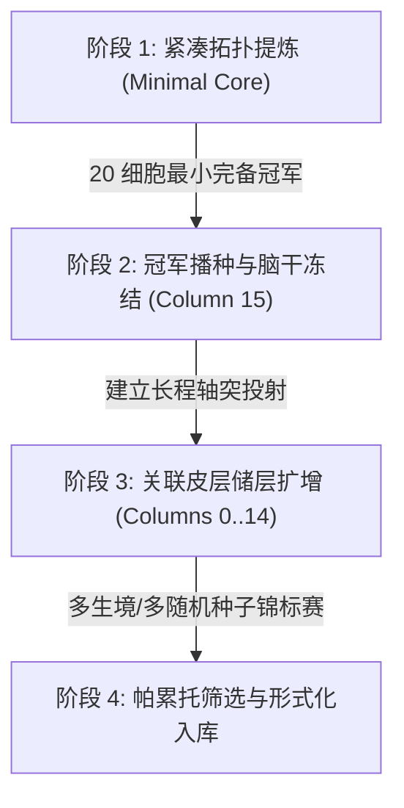

# SDSCC 大规模演化方法论：脚手架微柱层级发育与冠军播种 (Scaffolded Columnar Evo-Devo)

> **适用范围**：KunCellular 外围任务演化器、大规模 GPU 储层训练管线、多生境具身生命体发育  
> **底层约束**：严格遵守 [AGENTS.md](file:///home/caixuf/code/kun-cellular/AGENTS.md) 与 [ARCHITECTURE_DISCIPLINE.md](file:///home/caixuf/code/kun-cellular/docs/ARCHITECTURE_DISCIPLINE.md) 第六宪条——**绝对禁止修改 C/C++ 计算底座**。

---

## 零、 核心结论与底座免疫宪律

1. **绝对不要改动底层计算基座 (`include/kun/cellular/...`)**：
   - 底座是纯粹的通用硅基物理图执行引擎，28 类动力学原语（含微积分、迟滞门控、振荡器等）、Kahn 拓扑排序与硬件内存对齐已完全完备；
   - “利用冠军做温启动、层级播种与反复多生境筛选”纯属**外围演化算法（Evolutionary Strategy）与训练学（Curriculum Learning）范畴**，100% 封闭在 `tools/` 与 `tasks/` 适配层，严禁任何业务/算法逻辑反向污染底座。

---

## 一、 为什么不能从零盲目演化大规模网络（尺度与熵增真相）

实测对账（200 个全新未知 21×21 迷宫盲测）：
- **纯反应式无内态体 (11 细胞)**：1200 步通关率 **23.5%**（物理极限环死锁）。
- **三权分立内态记忆体 (20 细胞)**：1200 步通关率 **78.5%**，5500 步达到 **100.0%**。
- **1024 细胞冷启动 GPU 演化 (16 微柱 × 64 细胞)**：1200 步通关率 **53.0%**。

### 科学洞察：
1. **维度灾难与热力学熵增**：
   - 1024 细胞意味着 65,536 维突触空间。无引导的纯高斯随机变异在如此高维的相空间中，有 99.999% 的概率引入无序热噪声，破坏精细的转向时序。
2. **尺度真理（宪章第四条）**：
   - 低维任务（如 4 输入 2 输出）的动力学流形契约宽度小，20 细胞具备的硬件双稳态原语（`GATE_HYSTERESIS` + `GATE_THRESHOLD`）即可达成信噪比无限高的最优完备解；
   - 大规模细胞（千至百万级）的价值在于**高维时空储层与全息联想**，必须通过**层级发育**组织，不能靠从零均质随机变异。

---

## 二、 冠军脚手架层级发育演化规程 (Scaffolded Evo-Devo Protocol)

生物大脑并非均质随机网络，而是分层发育演化而来的：**高度保守的脑干反射弧 → 边缘系统工作记忆 → 巨量神经元新皮层**。

我们在外围训练管线中规范如下四步演化法：



### 步骤 1：紧凑基线微柱提炼（Minimal Core Discovery）
- 在单微柱（如 64 细胞槽位）内，通过强选择压力演化出满足基础鲁棒性的紧凑冠军体（如 20 细胞三权分立核）。
- 锁定关键控制逻辑：前向推进、迟滞转向锁存、边缘阻尼。

### 步骤 2：冠军基因播种与脑干保护（Brainstem Freezing & Seeding）
- 在大规模 GPU 种群（如 16 微柱 × 64 细胞 = 1024 细胞）中，将紧凑冠军整图直接播种于**第 15 柱（运动执行效应微柱）**；
- **突触冻结/低学习率保护**：
  - 对第 15 柱内的核心存活突触施加极低变异率（≤ 0.001）或结构性冻结，确保生命体在任何演化世代都绝不丧失基础生存本能（保底 78.5% 通关能力）。

### 步骤 3：关联皮层储层扩增（Cortical Reservoir Evolution）
- 开放其余 15 个微柱（微柱 0..14，共 960 细胞）作为高维时空联想皮层：
  - 皮层内部突触初始化为临界状态（谱半径 ρ ≈ 0.9）；
  - 允许微柱 0..14 演化产生长程轴突，单向投射至第 15 柱的调控受体；
  - **核心机制**：让高维皮层充当“全局地貌表征器”，只负责微调和调制脑干的动作幅度，而非直接接管底层运动。

### 步骤 4：多生境代际筛选与帕累托过滤（Multi-Niche Pareto Selection）
- 严禁在单一迷宫或固定数个种子上过拟合；
- 每代必须引入 **域随机化（Domain Randomization）**：
  - 随机通道拓扑、随机死胡同深度、随机网格尺度（11×11 到 21×21）；
- 选择压力函数采用帕累托双目标：
  $$\text{Fitness} = \alpha \cdot \text{通关成功率 (SR)} + \beta \cdot \text{新探索瓦片数} - \gamma \cdot \text{细胞能耗与碰撞率}$$

---

## 三、 代码工程规范与落地示例

所有脚手架发育逻辑一律在 `tools/` 或外围 Python/C++ 训练脚本中实现：

```python
# tools/train_maze_gpu_scale.py 中的标准脚手架范式
pop = CUDACellularPopulation(pop_size=256, num_columns=16, cells_per_col=64, ...)

# 1. 播种已知最优冠军至第 15 柱 (脑干微柱)
transplant_champion(pop, "checkpoints/maze_tripartite_champion.bin")

# 2. 仅对皮层 (Columns 0..14) 及皮层->脑干跨柱投射施加变异
def targeted_cortical_mutate(pop):
    # 保持第 15 柱内部突触不变 (脑干冻结)
    # 变异微柱 0..14 的突触与状态
    pop.intra_weights[:, :15] += torch.randn_like(pop.intra_weights[:, :15]) * 0.05
    # 变异皮层到效应柱的长程调制突触
    pop.inter_weights += torch.randn_like(pop.inter_weights) * 0.02
```

---

## 四、 总结与自律警示

- **底座是绝对不变的物理学定律**（万有引力、麦克斯韦方程、细胞原语动力学）；
- **演化策略是生命体在环境中的适应与学习**；
- 严禁将演化技巧（温启动、变异算子、任务过滤）混为一谈倒灌进底座！保持底座纯粹性，是硅基细胞计算机通往大规模图灵通用计算的根本保障。
