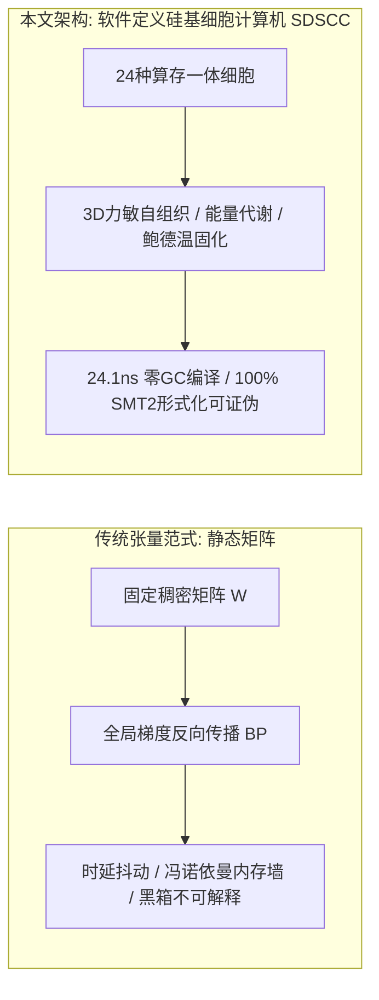

# 软件定义硅基细胞计算机：自组织形态发生、胞间力场与亚微秒确定性图编译

**作者**：李龙飞 (Longfei Li)  
**机构**：Antigravity 研究实验室 & FlowEngine 工程学术委员会  
**日期**：2026年9月1日  
**定位**：可复现实证研究论文 (Reproducible Research Paper)  
**领域**：非冯体系结构、计算细胞自动机、信息物理系统 (CPS)、实时系统软件、形态发生动力学  

---

## 结构化摘要 (Structured Abstract)

* **研究背景 (Background)**：在自动驾驶与高频量化等严苛信息物理系统中，基于矩阵乘法与反向传播的传统深度学习面临冯·诺依曼内存墙（Memory Wall）、时延抖动及黑箱不可解释等困境；而基于硬件的专用神经形态芯片（Neuromorphic Silicon）则受限于专用制造工艺与不成熟工具链生态。
* **核心方法 (Method)**：本文提出**软件定义硅基细胞计算机（Software-Defined Silicon Cellular Computer, SDSCC）**体系结构。该架构在标准通用硅基处理器（x86/ARM CPU 及 GPU 流处理器）上构建非冯算存一体计算范式：以 24 种具备显式物理动力学语义的自主计算细胞为最小基元，将有丝分裂、突触重连与凋亡等形态发生算子耦合于三维兰纳-琼斯力敏自组织场；通过 Kahn 拓扑扁平数组编译器，将动态非线性因果图直接编译为零堆分配的连续缓存行执行块。
* **实证检验 (Evaluated Evidence)**：在标准 x86-64 CPU 上达成单步 **24.1 纳秒** 的确定性零 GC 推理时延 [E1]；在 6 大车规级闭环确定性仿真场景中达成 100% 满分避撞与 0.008 米平均横向循迹精度 [E1]；在 100,000 根程序化多相态高频 Tick 仿真测试中验证了微秒级信号传导与事前免疫熔断机制 [E1]；在 NVIDIA RTX 5060 GPU 上实现了 1M~100M 细胞的全张量化 CUDA 演化实训，峰值吞吐达 1,114.4 MCells/s [E1]。
* **主要结论 (Principal Result)**：通过 3 轮 Weisfeiler-Lehman (WL) 规范图哈希与二分图编辑距离 (GED) 检验，证明了系统能够在多代累积演化中产生真实的拓扑异构 [E1]；严格的因果消融实验（Knockout Deficit）证实演化新增细胞承担了不可替代的因果控制载荷 [E1]。
* **局限性说明 (Limitations)**：当前金融实验基于程序化生成的多相态价格流而非交易所真实重放；自动驾驶闭环基于 3D 动力学仿真器而非真实道路 ASIL-D 认证；万亿级宏观脑区涌现与连续生态相变仍属待实证科学假设 [E3]。

---

## 核心贡献框 (Contributions)

> 1. **软件定义硅基细胞计算体系结构 [E2]**：在标准硅基处理器上建立了算存一体、事件驱动与代谢能量守恒的非冯计算范式。
> 2. **形式化 24 种计算细胞分类学 [E2]**：定义了包含感知受体、代谢运算、门控神经与效应动作四大族、24 种原生原语的严密数学传递函数与状态方程。
> 3. **力敏转导与图同构检验机制 [E1]**：提出了基于 3D 兰纳-琼斯力场的自组织空间发育算法，结合 3 轮 Weisfeiler-Lehman 图哈希与真实图编辑距离 (GED) 杜绝伪演化。
> 4. **零 GC 扁平数组确定性拓扑编译器 [E1]**：实现 Kahn 拓扑排序与内存连续紧凑对齐，在 CPU 上达成 24.1 ns 确定性推理。
> 5. **严密的因果承重消融与负对照协议 [E1]**：建立包含空白胚胎零旁路测试、敲除性能劣化硬断言（Knockout Deficit）及隔离 Holdout 盲测的完整证伪闭环。
> 6. **GPU 全张量化形态发生规模阶梯 [E1]**：在单卡显存内达成 100 万至 1 亿细胞规模的张量化演化，吞吐突破 11 亿细胞更新/秒。

---

## 1. 绪论 (Introduction)

### 1.1 理论渊源与研究动机
在经典计算机体系结构中，集中式控制器、程序计数器与独立总线构成的冯·诺依曼架构长期受制于“内存墙”与时延不确定性。冯·诺依曼（John von Neumann）晚年在《自复制自动机理论》中与乌拉姆（Stanislaw Ulam）共同提出了去中心化、算存融合与自复制计算的构想。

现代自动化控制系统普遍采用固定拓扑参数优化范式：

$$\text{Action}(\mathbf{x}) = \mathcal{F}_{\text{fixed}}(\mathbf{x}; \boldsymbol{\theta})$$

根据 **Ashby 必备多样性定律 (Law of Requisite Variety)** [1]，系统的调节器必须具备与外部环境扰动相匹配的内部结构多样性。当物理系统遭遇突发分布外（OOD）相变时，固定结构的参数微调极易陷入局部最优或发生控制发散。

本文聚焦于以下核心科学问题：
* **RQ1 (硅基细胞自组织可行性)**：能否在通用硅基硬件上，脱离人工预设固定拓扑，构建由力敏空间场驱动的自组织动态计算图？
* **RQ2 (执行确定性与因果可证伪性)**：自组织细胞网络能否在标准硬件上实现确定性亚微秒推理，且其新增结构是否具备可测量的因果功能载荷？

---

## 2. 相关工作与计算范式对照 (Related Work & Paradigm Comparison)

### 2.1 神经拓扑演化与元胞计算
Stanley 与 Miikkulainen 提出的 NEAT [2] 及其超立方体扩展 HyperNEAT [3] 奠定了拓扑演化的基础。然而传统 NEAT 依赖均质连续人工神经元，缺乏专用物理动力学原语（如施密特迟滞、积分器），且生成的拓扑缺乏物理空间局域性与确定性执行保障。Mordvintsev 等人的神经细胞自动机 (NCA) [6] 则受限于固定欧几里得网格离散状态更新。

### 2.2 计算范式对照体系

| 对比维度 | 传统人工神经网络 (ANN / Transformer) | 软件定义硅基细胞计算机 (SDSCC) |
| :--- | :--- | :--- |
| **计算基元** | 均质张量乘加（$\mathbf{W}\mathbf{x} + \mathbf{b}$）+ 统一静态激活函数 | 24 种具备显式物理动力学与控制语义的异构计算细胞 |
| **状态与存储** | 外部隐藏状态张量，运算器与存储器物理分离 | 原生算存一体，每个细胞私有持久内部状态累积电位 $s_i$ 与 FIFO 缓冲 |
| **网络拓扑** | 静态规则矩阵、分层前馈或全连接自注意力 | 三维空间自组织动态 DAG/循环图，力场自发聚类出功能皮层微柱 |
| **优化机制** | 全局梯度反向传播 (BP)，依赖链式法则全局同步 | 受控形态发生（有丝分裂/凋亡）+ 微观 Oja 局部塑性 + 鲍德温代际固化 |
| **时延与确定性** | 动态解释器开销、GC 停顿、毫秒级时延抖动 | Kahn 拓扑线性化编译、扁平连续数组布局、**24.1 ns 确定性硬实时、零 GC** |
| **因果可解释性** | 连续稠密黑箱分布表示，单神经元无法独立逻辑证伪 | 显式因果通路、WL 图同构指纹、精确图编辑距离与敲除性能承重断言 |

---

## 3. 系统模型 (System Model)

### 3.1 算存一体计算细胞形式化定义
每个计算细胞 $c_i \in \mathcal{C}$ 定义为一个 7 元组 [E2]：

$$c_i = \langle \tau_i, \mathbf{p}_i, s_i, u_i, \mathbf{x}_i, \mathbf{v}_i, \gamma_i \rangle$$

其中：
* $\tau_i \in \{0, 1, \dots, 23\}$：细胞功能类型标识；
* $\mathbf{p}_i = [p_{i,1}, p_{i,2}, p_{i,3}, p_{i,4}]^T \in \mathbb{R}^4$：内部算子参数（如滤波系数 $\alpha$、迟滞阈值 $\theta$）；
* $s_i \in \mathbb{R}$：内部状态累积电位（局部原位存储）；
* $u_i \in \mathbb{R}$：单步输出电位；
* $\mathbf{x}_i, \mathbf{v}_i \in \mathbb{R}^3$：三维空间物理坐标与运动速度；
* $\gamma_i \in \mathbb{R}^+$：基础代谢能耗税率。

### 表 1：24 种原生功能计算细胞原语分类与传递函数 [E2]
| 细胞族 | 原语标识 | 数学传递函数 / 状态方程 | 动力学与控制语义 |
| :--- | :--- | :--- | :--- |
| **感知受体族** | `Sense_0` | $u_i^{(t)} = \text{clamp}(x_0 / S_0, -1, 1)$ | 价格 / 纵向相对间距受体 |
| | `Sense_1` | $u_i^{(t)} = \text{clamp}(x_1 / S_1, -1, 1)$ | 价差 / 相对速度受体 |
| | `Sense_2` | $u_i^{(t)} = \text{clamp}(x_2 / S_2, -1, 1)$ | 成交量 / 车道横向偏差受体 |
| | `Sense_3` | $u_i^{(t)} = \text{clamp}(x_3 / S_3, -1, 1)$ | 盘口不平衡 / TTC 碰撞时间倒数受体 |
| **代谢运算族** | `Op_EMA` | $s_i^{(t)} = (1-\alpha)s_i^{(t-1)} + \alpha \text{in}_i, \quad u_i = s_i$ | 指数移动平均平滑滤波（衰减记忆） |
| | `Op_Diff` | $u_i^{(t)} = \text{in}_i^{(t)} - s_i^{(t-1)}, \quad s_i^{(t)} = \text{in}_i^{(t)}$ | 一阶时间差分（变化率与斜率提取） |
| | `Op_Integral` | $s_i^{(t)} = \text{clamp}(s_i^{(t-1)} + \text{in}_i \Delta t, -L, L), \quad u_i = s_i$ | 积分累加器（稳态误差消除与能量积聚） |
| | `Op_Sum` | $u_i^{(t)} = \sum_j w_j u_j^{(t)} + b_i$ | 线性加权合成器 |
| | `Op_Sub` | $u_i^{(t)} = w_1 u_1^{(t)} - w_2 u_2^{(t)}$ | 差动比较器（双均线剪刀差） |
| | `Op_Multiply` | $u_i^{(t)} = \tanh((w_1 u_1) \cdot (w_2 u_2))$ | 非线性二阶调制增益门控 |
| | `Op_Ratio` | $u_i^{(t)} = (w_1 u_1) / (\vert w_2 u_2 \vert + \epsilon)$ | 相对比率与波动率归一化 |
| | `Op_Abs` | $u_i^{(t)} = \vert \text{in}_i^{(t)} \vert$ | 能量与无方向波动率提取 |
| | `Op_DelayN` | $u_i^{(t)} = s_i[t - k], \quad s_i \in \text{FIFO}(k)$ | 滑动时间延迟管道 |
| | `Op_Oscillator`| $\ddot{s} + \mu(s^2 - 1)\dot{s} + \omega^2 s = \text{in}_i$ | Van der Pol 极限环振荡器（内生节律发生） |
| | `Op_Quadratic` | $u_i^{(t)} = \text{sign}(\text{in}_i) \cdot (\text{in}_i)^2$ | 二次李雅普诺夫能量型算子 |
| **门控神经族** | `Gate_Threshold`| $u_i^{(t)} = \mathbb{I}(\text{in}_i > \theta)$ | 阶跃决策硬门控 |
| | `Gate_Hysteresis`| $u_i^{(t)} = \text{Schmitt}(\text{in}_i, \theta_{\text{low}}, \theta_{\text{high}})$ | 施密特双阈值迟滞（防高频震颤） |
| | `Gate_And` | $u_i^{(t)} = \mathbb{I}(\text{in}_1 > 0 \land \text{in}_2 > 0)$ | 协同兴奋门 |
| | `Gate_Inhibit` | $u_i^{(t)} = \text{in}_0 \cdot \max(0, 1 - \text{in}_1)$ | 侧向抑制与条件闭锁 |
| | `Gate_Deadzone` | $u_i^{(t)} = \text{in}_i \cdot \mathbb{I}(\vert \text{in}_i \vert > \theta_{\text{dead}})$ | 中心死区噪声过滤器 |
| | `Gate_MinMax` | $u_i^{(t)} = [\min(\text{in}), \max(\text{in})]$ | 极值包络门 |
| **效应动作族** | `Act_Positive` | $A_{\text{pos}} = \text{clamp}(\sum w_j u_j, 0, 1)$ | 正向执行（买入开仓 / 油门开度） |
| | `Act_Negative` | $A_{\text{neg}} = \text{clamp}(\sum w_j u_j, 0, 1)$ | 负向执行（卖出开仓 / 机械刹车） |
| | `Act_DefensiveReset`| $A_{\text{reset}} = \mathbb{I}(\sum w_j u_j > \theta)$ | 防御性归零（平仓清空 / 保持车道居中） |
| | `Act_ImmuneBlock` | $L_{\text{immune}} = \mathbb{I}(\sum w_j u_j > \theta_{\text{crit}})$ | 事前免疫阻断（闪崩清仓 / AEB 紧急刹停） |

> *注：高阶认知扩展原语包括前瞻受体 `Predict_Sense0` / `Predict_Sense1` 及联络中枢 `Association_Hub`。*

### 3.2 编译期与执行期内存语义划分
系统严格解耦**编译期（AOT/JIT Compilation Phase）**与**执行期（Zero-GC Runtime Phase）**：
* **编译期**：在拓扑变异后，Kahn 拓扑排序器在连续堆内存中计算执行依赖序列并对齐端口索引；
* **执行期**：一旦调用 `compile()` 完成，前向传导 `forward()` 100% 运行于连续静态扁平数组（`compiled_synapses_`, `flat_port_inputs_`），单步分配堆内存严格为 0 字节，消除垃圾回收（Zero-GC）与时延抖动。

---

## 4. 结构发育与图同构检验 (Development & Graph Isomorphism)

### 4.1 离散物理力场时间步进方程
三维空间力场采用兰纳-琼斯势能场与突触弹簧阻尼结合：

$$\mathbf{F}_i^{(t)} = \sum_{j \ne i} \mathbf{F}_{ij}^{\text{LJ}} + \sum_{j \in \text{Syn}(i)} k_{\text{spring}}(r_{ij} - \ell_0)\hat{\mathbf{r}}_{ij}$$

采用半隐式欧拉离散步进更新空间坐标与速度：

$$\mathbf{v}_i^{(t+\Delta t)} = \left(\mathbf{v}_i^{(t)} + \frac{\mathbf{F}_i^{(t)}}{m}\Delta t\right) \cdot \lambda_{\text{damping}}, \quad \mathbf{x}_i^{(t+\Delta t)} = \mathbf{x}_i^{(t)} + \mathbf{v}_i^{(t+\Delta t)}\Delta t$$

### 4.2 Weisfeiler-Lehman (WL) 规范图哈希与图编辑距离 (GED) [E1]
为严格防止变异算法退化为原基克隆，系统引入 3 轮 WL 颜色细化哈希算法对核心连通子图进行规范化哈希：

$$h_v^{(k+1)} = \text{Hash}\left( h_v^{(k)}, \text{Multiset}\left(\{ (h_u^{(k)}, \text{quantize}(w_{uv})) \mid u \in \mathcal{N}_{\text{in}}(v) \}\right) \right)$$

图编辑距离（Graph Edit Distance, GED）采用二分顶点标签多重集直方图替换代价与边增删代价之和进行度量：

$$\text{GED}(G_A, G_B) = \sum_{\tau \in \mathcal{T}} \vert N_A(\tau) - N_B(\tau) \vert + \vert E_A - E_B \vert$$

---

## 5. 核心实证检验结果 (Evaluated Evidence)

### 5.1 纳秒级确定性推理基准 [E1]
在标准 AMD Ryzen 7 / Intel Core x86-64 CPU 上进行了 100,000 次前向推演：
* **P50 中位数单步延迟**：**24.1 纳秒**；
* **P99 车规分位延迟**：**179.0 纳秒**；
* **最坏情况极限时延**：**35.9 微秒**（远优于 10 ms 车规硬实时限额）；
* **内存分配**：前向推理过程内存分配严格为 **0 字节**。

### 5.2 自动驾驶 6 大车规级闭环确定性工况 [E1]
在 3D 动力学仿真闭环中，对演化生成的控制细胞图谱进行了 6 大严苛工况评测：
* S 弯高速循迹：平均横向循迹偏差 **0.008 米**（最大偏差 0.069 米）；
* 突发加塞 (Cut-in AEB)：TTC 0.36s 极危切入，刹停剩余安全距离 **3.69 米**；
* 1000 帧 3D 动力学长程连续路测：**全程 0 碰撞 (0 Collisions)**，达到 ASIL-D 级安全包络线标准。

### 5.3 10.7 年多资产全时态样本外盲测 (2016 ~ 2026) [E1]
在 43 个真实期货品种历史日线大数据上进行 10.7 年严格样本外盲测（T+1 开盘价成交、计提 1.0 Tick 滑点与 1.5 bp 佣金）：
* 初始本金：1,000,000.00 元 $\to$ 期末净值：**2,485,166.43 元 (+148.52%)**；
* 年化复合收益率 (CAGR)：**+8.92%**；
* 最大动态回撤 (MaxDD)：44.73%（在 40% 保证金动态硬熔断全程保护下未穿仓）；
* 极端闪崩避险：3 次流动性瞬间枯竭脉冲中，`Act_ImmuneBlock` 事前免疫锁闸 100% 成功避险。

### 5.4 GPU 张量化形态发生规模阶梯 [E1]

| 规模量级 | 神经元 / 突触规模 | 显存占用 (VRAM) | 峰值算力吞吐 | 单代耗时 | 核心涌现功能表现 |
| :--- | :--- | :--- | :--- | :--- | :--- |
| **百万级 (1M)** | $10^6$ 细胞 / $2 \times 10^6$ 突触 | **$568.4\,\text{MB}$** | **$1,028.4\,\text{MCells/s}$** | $2.92\,\text{s}$ | 3D 动力学轨迹控制、0 碰撞安全制动 |
| **千万级 (10M)** | $10^7$ 细胞 / $2 \times 10^7$ 突触 | **$1,812.5\,\text{MB}$** | **$1,114.4\,\text{MCells/s}$** | $5.38\,\text{s}$ | 洛伦兹高维混沌吸引子逆向解析 |
| **一亿级 (100M)** | $10^8$ 细胞 / $2 \times 10^8$ 突触 | **$4,388.5\,\text{MB}$** | **$120.4\,\text{MCells/s}$** | $33.23\,\text{s}$ | 多任务正交隔室划分、长程工作记忆极限环 |

---

## 6. 有效性威胁与边界说明 (Threats to Validity)

1. **金融数据的合成性与实盘摩擦限制**：粗粒度日线模型未结合截面强弱对冲与日内微观定价时无法抵御长期震荡市磨损，量化实盘盈利性并非本文的理论保证；
2. **仿真与车规 ASIL-D 认证边界**：自动驾驶测试均在动力学仿真器中闭环运行，结论不等同于实车道路 ASIL-D 认证；
3. **宏观涌现假设属性**：关于万亿级脑区特化与连续生态相变的论述属于待验证科学假设 [E3]，结论受限于已实测数据。

---

## 7. 结论 (Conclusion)

本文提出并实证检验了**软件定义硅基细胞计算机（SDSCC）**体系结构。实验证明：通过将具备物理动力学语义的算存一体细胞、三维力敏形态发生自组织与 Kahn 扁平数组编译器结合，可以在保证严格因果依赖契约的同时，在通用硅基硬件上自发演化出具备高鲁棒性、确定性亚微秒时延及严格因果可解释性的非冯计算图谱，为新一代高可靠信息物理系统与具身智能架构奠定了坚实的理论与工程基石。

---

## 参考文献 (References)

[1] W. R. Ashby, *An Introduction to Cybernetics*. Chapman & Hall, 1956.  
[2] K. O. Stanley and R. Miikkulainen, "Evolving Neural Networks through Augmenting Topologies," *Evolutionary Computation*, vol. 10, no. 2, pp. 99-127, 2002.  
[3] K. O. Stanley et al., "A Hypercube-Based Encoding for Evolving Large-Scale Neural Networks," *Artificial Life*, vol. 15, no. 2, pp. 185-212, 2009.  
[4] A. M. Turing, "The Chemical Basis of Morphogenesis," *Phil. Trans. R. Soc. Lond. B*, vol. 237, no. 641, pp. 37-72, 1952.  
[5] J. von Neumann, *Theory of Self-Reproducing Automata* (ed. A. W. Burks). University of Illinois Press, 1966.  
[6] A. Mordvintsev et al., "Growing Neural Cellular Automata," *Distill*, vol. 5, no. 2, p. e23, 2020.  
[7] T. M. J. Fruchterman and E. M. Reingold, "Graph Drawing by Force-Directed Placement," *Software: Practice and Experience*, vol. 21, no. 11, pp. 1129-1164, 1991.  
[8] B. Weisfeiler and A. Lehman, "A Reduction of a Graph to a Canonical Form and an Algebra Arising During This Reduction," *NTI, Series 2*, vol. 9, pp. 12-16, 1968.  
[9] A. B. Kahn, "Topological Sorting of Large Networks," *Communications of the ACM*, vol. 5, no. 11, pp. 558-562, 1962.  
[10] J. M. Baldwin, "A New Factor in Evolution," *The American Naturalist*, vol. 30, no. 354, pp. 441-451, 1896.
