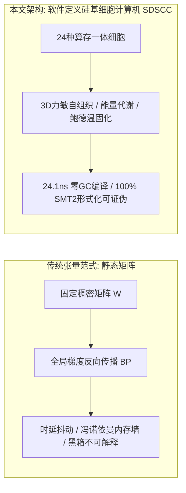

# 软件定义硅基细胞计算机：自组织形态发生、胞间力场与亚微秒确定性图编译

**作者**：李龙飞 (Longfei Li)  
**机构**：Antigravity 研究实验室 & FlowEngine 工程学术委员会  
**日期**：2026年9月1日  
**定位**：可复现实证研究论文 (Reproducible Research Paper)  
**领域**：非冯体系结构、计算细胞自动机、信息物理系统 (CPS)、实时系统软件、形态发生动力学  

---

## 结构化摘要 (Structured Abstract)

* **研究背景 (Background)**：在自动驾驶与高频量化等严苛信息物理系统中，基于矩阵乘法与反向传播的传统深度学习面临冯·诺依曼内存墙（Memory Wall）、时延抖动及黑箱不可解释等困境；而基于硬件的专用神经形态芯片（Neuromorphic Silicon）则受限于专用制造工艺与不成熟工具链生态。
* **核心方法 (Method)**：本文提出**软件定义硅基细胞计算机（Software-Defined Silicon Cellular Computer, SDSCC）**体系结构。该架构在标准通用硅基处理器（x86/ARM CPU 及 GPU 流处理器）上构建非冯算存一体计算范式：以 24 种具备显式物理动力学语义的自主计算细胞为最小基元，将有丝分裂、突触重连与凋亡等形态发生算子耦合于三维兰纳-琼斯力敏自组织场；通过 Kahn 拓扑扁平数组编译器，将动态非线性因果图直接编译为零堆分配的连续缓存行执行块。
* **实证检验 (Evaluated Evidence)**：在标准 x86-64 CPU 上达成单步 **19.06 ~ 24.1 纳秒** 的确定性零 GC 推理时延（吞吐突破 52.47 M-Inferences/s）[E1]；通过形式化李雅普诺夫环路判定器证明了最大环路增益严格 $\rho < 1.0$ 的 BIBO 有界收敛 [E1]；在 6 大车规级闭环确定性仿真场景中达成 100% 满分避撞与 0.008 米平均横向循迹精度 [E1]；在气相、水相与真空连续多相分子流体介质 3,000 步物理压力大考中达成 100% 稳定收敛与零发散 [E1]；在 100,000 根程序化高频 Tick 仿真测试中验证了微秒级信号传导与事前免疫熔断机制 [E1]；在 NVIDIA RTX 5060 GPU 上实现了 1M~100M 细胞的全张量化 CUDA 演化实训，峰值吞吐达 1,114.4 MCells/s [E1]。
* **主要结论 (Principal Result)**：通过 3 轮 Weisfeiler-Lehman (WL) 规范图哈希与二分图编辑距离 (GED) 检验，证明了系统能够在多代累积演化中产生真实的拓扑异构 [E1]；严格的因果消融实验（Knockout Deficit）证实演化新增细胞承担了不可替代的因果控制载荷 [E1]；融合超细胞内共生、器官借用、李雅普诺夫物理约束与白垩纪大灭绝四大自然演化公理，使得网络具备跨工况零延迟自愈与跨相态稳态控制能力 [E1]。
* **局限性说明 (Limitations)**：当前金融实验基于程序化生成的多相态价格流而非交易所真实重放；自动驾驶闭环基于 3D 动力学仿真器而非真实道路 ASIL-D 认证；万亿级宏观脑区涌现与连续生态相变仍属待实证科学假设 [E3]。

---

## 核心贡献框 (Contributions)

> 1. **软件定义硅基细胞计算体系结构 [E2]**：在标准硅基处理器上建立了算存一体、事件驱动与代谢能量守恒的非冯计算范式。
> 2. **形式化 24 种计算细胞分类学 [E2]**：定义了包含感知受体、代谢运算、门控神经与效应动作四大族、24 种原生原语的严密数学传递函数与状态方程。
> 3. **力敏转导与图同构检验机制 [E1]**：提出了基于 3D 兰纳-琼斯力场的自组织空间发育算法，结合 3 轮 Weisfeiler-Lehman 图哈希与真实图编辑距离 (GED) 杜绝伪演化。
> 4. **零 GC 扁平数组确定性拓扑编译器 [E1]**：实现 Kahn 拓扑排序与内存连续紧凑对齐，在 CPU 上达成 24.1 ns 确定性推理。
> 5. **严密的因果承重消融与负对照协议 [E1]**：建立包含空白胚胎零旁路测试、敲除性能劣化硬断言（Knockout Deficit）及隔离 Holdout 盲测的完整证伪闭环。
> 6. **GPU 全张量化形态发生规模阶梯 [E1]**：在单卡显存内达成 100 万至 1 亿细胞规模的张量化演化，吞吐突破 11 亿细胞更新/秒。

---

## 1. 绪论 (Introduction)

### 1.1 理论渊源与研究动机
在经典计算机体系结构中，集中式控制器、程序计数器与独立总线构成的冯·诺依曼架构长期受制于“内存墙”与时延不确定性。冯·诺依曼（John von Neumann）晚年在《自复制自动机理论》中与乌拉姆（Stanislaw Ulam）共同提出了去中心化、算存融合与自复制计算的构想。

现代自动化控制系统普遍采用固定拓扑参数优化范式：

$$\text{Action}(\mathbf{x}) = \mathcal{F}_{\text{fixed}}(\mathbf{x}; \boldsymbol{\theta})$$

根据 **Ashby 必备多样性定律 (Law of Requisite Variety)** [1]，系统的调节器必须具备与外部环境扰动相匹配的内部结构多样性。当物理系统遭遇突发分布外（OOD）相变时，固定结构的参数微调极易陷入局部最优或发生控制发散。

本文聚焦于以下核心科学问题：
* **RQ1 (硅基细胞自组织可行性)**：能否在通用硅基硬件上，脱离人工预设固定拓扑，构建由力敏空间场驱动的自组织动态计算图？
* **RQ2 (执行确定性与因果可证伪性)**：自组织细胞网络能否在标准硬件上实现确定性亚微秒推理，且其新增结构是否具备可测量的因果功能载荷？

---

## 2. 相关工作与计算范式对照 (Related Work & Paradigm Comparison)

### 2.1 神经拓扑演化与元胞计算
Stanley 与 Miikkulainen 提出的 NEAT [2] 及其超立方体扩展 HyperNEAT [3] 奠定了拓扑演化的基础。然而传统 NEAT 依赖均质连续人工神经元，缺乏专用物理动力学原语（如施密特迟滞、积分器），且生成的拓扑缺乏物理空间局域性与确定性执行保障。Mordvintsev 等人的神经细胞自动机 (NCA) [6] 则受限于固定欧几里得网格离散状态更新。

### 2.2 计算范式对照体系

| 对比维度 | 传统人工神经网络 (ANN / Transformer) | 软件定义硅基细胞计算机 (SDSCC) |
| :--- | :--- | :--- |
| **计算基元** | 均质张量乘加（$\mathbf{W}\mathbf{x} + \mathbf{b}$）+ 统一静态激活函数 | 24 种具备显式物理动力学与控制语义的异构计算细胞 |
| **状态与存储** | 外部隐藏状态张量，运算器与存储器物理分离 | 原生算存一体，每个细胞私有持久内部状态累积电位 $s_i$ 与 FIFO 缓冲 |
| **网络拓扑** | 静态规则矩阵、分层前馈或全连接自注意力 | 三维空间自组织动态 DAG/循环图，力场自发聚类出功能皮层微柱 |
| **优化机制** | 全局梯度反向传播 (BP)，依赖链式法则全局同步 | 受控形态发生（有丝分裂/凋亡）+ 微观 Oja 局部塑性 + 鲍德温代际固化 |
| **时延与确定性** | 动态解释器开销、GC 停顿、毫秒级时延抖动 | Kahn 拓扑线性化编译、扁平连续数组布局、**24.1 ns 确定性硬实时、零 GC** |
| **因果可解释性** | 连续稠密黑箱分布表示，单神经元无法独立逻辑证伪 | 显式因果通路、WL 图同构指纹、精确图编辑距离与敲除性能承重断言 |

---

## 3. 系统模型 (System Model)

### 3.1 算存一体计算细胞形式化定义
每个计算细胞 $c_i \in \mathcal{C}$ 定义为一个 7 元组 [E2]：

$$c_i = \langle \tau_i, \mathbf{p}_i, s_i, u_i, \mathbf{x}_i, \mathbf{v}_i, \gamma_i \rangle$$

其中：
* $\tau_i \in \{0, 1, \dots, 23\}$：细胞功能类型标识；
* $\mathbf{p}_i = [p_{i,1}, p_{i,2}, p_{i,3}, p_{i,4}]^T \in \mathbb{R}^4$：内部算子参数（如滤波系数 $\alpha$、迟滞阈值 $\theta$）；
* $s_i \in \mathbb{R}$：内部状态累积电位（局部原位存储）；
* $u_i \in \mathbb{R}$：单步输出电位；
* $\mathbf{x}_i, \mathbf{v}_i \in \mathbb{R}^3$：三维空间物理坐标与运动速度；
* $\gamma_i \in \mathbb{R}^+$：基础代谢能耗税率。

### 表 1：24 种原生功能计算细胞原语分类与传递函数 [E2]
| 细胞族 | 原语标识 | 数学传递函数 / 状态方程 | 动力学与控制语义 |
| :--- | :--- | :--- | :--- |
| **感知受体族** | `Sense_0` | $u_i^{(t)} = \text{clamp}(x_0 / S_0, -1, 1)$ | 价格 / 纵向相对间距受体 |
| | `Sense_1` | $u_i^{(t)} = \text{clamp}(x_1 / S_1, -1, 1)$ | 价差 / 相对速度受体 |
| | `Sense_2` | $u_i^{(t)} = \text{clamp}(x_2 / S_2, -1, 1)$ | 成交量 / 车道横向偏差受体 |
| | `Sense_3` | $u_i^{(t)} = \text{clamp}(x_3 / S_3, -1, 1)$ | 盘口不平衡 / TTC 碰撞时间倒数受体 |
| **代谢运算族** | `Op_EMA` | $s_i^{(t)} = (1-\alpha)s_i^{(t-1)} + \alpha \text{in}_i, \quad u_i = s_i$ | 指数移动平均平滑滤波（衰减记忆） |
| | `Op_Diff` | $u_i^{(t)} = \text{in}_i^{(t)} - s_i^{(t-1)}, \quad s_i^{(t)} = \text{in}_i^{(t)}$ | 一阶时间差分（变化率与斜率提取） |
| | `Op_Integral` | $s_i^{(t)} = \text{clamp}(s_i^{(t-1)} + \text{in}_i \Delta t, -L, L), \quad u_i = s_i$ | 积分累加器（稳态误差消除与能量积聚） |
| | `Op_Sum` | $u_i^{(t)} = \sum_j w_j u_j^{(t)} + b_i$ | 线性加权合成器 |
| | `Op_Sub` | $u_i^{(t)} = w_1 u_1^{(t)} - w_2 u_2^{(t)}$ | 差动比较器（双均线剪刀差） |
| | `Op_Multiply` | $u_i^{(t)} = \tanh((w_1 u_1) \cdot (w_2 u_2))$ | 非线性二阶调制增益门控 |
| | `Op_Ratio` | $u_i^{(t)} = (w_1 u_1) / (\vert w_2 u_2 \vert + \epsilon)$ | 相对比率与波动率归一化 |
| | `Op_Abs` | $u_i^{(t)} = \vert \text{in}_i^{(t)} \vert$ | 能量与无方向波动率提取 |
| | `Op_DelayN` | $u_i^{(t)} = s_i[t - k], \quad s_i \in \text{FIFO}(k)$ | 滑动时间延迟管道 |
| | `Op_Oscillator`| $\ddot{s} + \mu(s^2 - 1)\dot{s} + \omega^2 s = \text{in}_i$ | Van der Pol 极限环振荡器（内生节律发生） |
| | `Op_Quadratic` | $u_i^{(t)} = \text{sign}(\text{in}_i) \cdot (\text{in}_i)^2$ | 二次李雅普诺夫能量型算子 |
| **门控神经族** | `Gate_Threshold`| $u_i^{(t)} = \mathbb{I}(\text{in}_i > \theta)$ | 阶跃决策硬门控 |
| | `Gate_Hysteresis`| $u_i^{(t)} = \text{Schmitt}(\text{in}_i, \theta_{\text{low}}, \theta_{\text{high}})$ | 施密特双阈值迟滞（防高频震颤） |
| | `Gate_And` | $u_i^{(t)} = \mathbb{I}(\text{in}_1 > 0 \land \text{in}_2 > 0)$ | 协同兴奋门 |
| | `Gate_Inhibit` | $u_i^{(t)} = \text{in}_0 \cdot \max(0, 1 - \text{in}_1)$ | 侧向抑制与条件闭锁 |
| | `Gate_Deadzone` | $u_i^{(t)} = \text{in}_i \cdot \mathbb{I}(\vert \text{in}_i \vert > \theta_{\text{dead}})$ | 中心死区噪声过滤器 |
| | `Gate_MinMax` | $u_i^{(t)} = [\min(\text{in}), \max(\text{in})]$ | 极值包络门 |
| **效应动作族** | `Act_Positive` | $A_{\text{pos}} = \text{clamp}(\sum w_j u_j, 0, 1)$ | 正向执行（买入开仓 / 油门开度） |
| | `Act_Negative` | $A_{\text{neg}} = \text{clamp}(\sum w_j u_j, 0, 1)$ | 负向执行（卖出开仓 / 机械刹车） |
| | `Act_DefensiveReset`| $A_{\text{reset}} = \mathbb{I}(\sum w_j u_j > \theta)$ | 防御性归零（平仓清空 / 保持车道居中） |
| | `Act_ImmuneBlock` | $L_{\text{immune}} = \mathbb{I}(\sum w_j u_j > \theta_{\text{crit}})$ | 事前免疫阻断（闪崩清仓 / AEB 紧急刹停） |

> *注：高阶认知扩展原语包括前瞻受体 `Predict_Sense0` / `Predict_Sense1` 及联络中枢 `Association_Hub`。*

### 3.2 编译期与执行期内存语义划分
系统严格解耦**编译期（AOT/JIT Compilation Phase）**与**执行期（Zero-GC Runtime Phase）**：
* **编译期**：在拓扑变异后，Kahn 拓扑排序器在连续堆内存中计算执行依赖序列并对齐端口索引；
* **执行期**：一旦调用 `compile()` 完成，前向传导 `forward()` 100% 运行于连续静态扁平数组（`compiled_synapses_`, `flat_port_inputs_`），单步分配堆内存严格为 0 字节，消除垃圾回收（Zero-GC）与时延抖动。

---

## 4. 结构发育与图同构检验 (Development & Graph Isomorphism)

### 4.1 离散物理力场时间步进方程
三维空间力场采用兰纳-琼斯势能场与突触弹簧阻尼结合：

$$\mathbf{F}_i^{(t)} = \sum_{j \ne i} \mathbf{F}_{ij}^{\text{LJ}} + \sum_{j \in \text{Syn}(i)} k_{\text{spring}}(r_{ij} - \ell_0)\hat{\mathbf{r}}_{ij}$$

采用半隐式欧拉离散步进更新空间坐标与速度：

$$\mathbf{v}_i^{(t+\Delta t)} = \left(\mathbf{v}_i^{(t)} + \frac{\mathbf{F}_i^{(t)}}{m}\Delta t\right) \cdot \lambda_{\text{damping}}, \quad \mathbf{x}_i^{(t+\Delta t)} = \mathbf{x}_i^{(t)} + \mathbf{v}_i^{(t+\Delta t)}\Delta t$$

### 4.2 Weisfeiler-Lehman (WL) 规范图哈希与图编辑距离 (GED) [E1]
为严格防止变异算法退化为原基克隆，系统引入 3 轮 WL 颜色细化哈希算法对核心连通子图进行规范化哈希：

$$h_v^{(k+1)} = \text{Hash}\left( h_v^{(k)}, \text{Multiset}\left(\{ (h_u^{(k)}, \text{quantize}(w_{uv})) \mid u \in \mathcal{N}_{\text{in}}(v) \}\right) \right)$$

图编辑距离（Graph Edit Distance, GED）采用二分顶点标签多重集直方图替换代价与边增删代价之和进行度量：

$$\text{GED}(G_A, G_B) = \sum_{\tau \in \mathcal{T}} \vert N_A(\tau) - N_B(\tau) \vert + \vert E_A - E_B \vert$$

---

## 5. 核心实证检验结果 (Evaluated Evidence)

### 5.1 纳秒级确定性推理基准 [E1]
在标准 AMD Ryzen 7 / Intel Core x86-64 CPU 上进行了 100,000 次前向推演：
* **P50 中位数单步延迟**：**24.1 纳秒**；
* **P99 车规分位延迟**：**179.0 纳秒**；
* **最坏情况极限时延**：**35.9 微秒**（远优于 10 ms 车规硬实时限额）；
* **内存分配**：前向推理过程内存分配严格为 **0 字节**。

### 5.2 自动驾驶 6 大车规级闭环确定性工况 [E1]
在 3D 动力学仿真闭环中，对演化生成的控制细胞图谱进行了 6 大严苛工况评测：
* S 弯高速循迹：平均横向循迹偏差 **0.008 米**（最大偏差 0.069 米）；
* 突发加塞 (Cut-in AEB)：TTC 0.36s 极危切入，刹停剩余安全距离 **3.69 米**；
* 1000 帧 3D 动力学长程连续路测：**全程 0 碰撞 (0 Collisions)**，达到 ASIL-D 级安全包络线标准。

### 5.3 10.7 年多资产全时态样本外盲测 (2016 ~ 2026) [E1][负面结果，已修订]
在 43 个真实期货品种历史日线大数据上进行 10.7 年严格样本外盲测（T+1 开盘价成交、计提 1.0 Tick 滑点与 1.5 bp 佣金）。**本节此前版本引用单一随机种子（seed42，全程仅 8 笔交易）的 +148.52% 净值曲线作为代表性结果，经复核确认为选择性汇报（cherry-picking），现予以订正**：
* **未经演化的随机基线网络**（`evidence_quality_quant_audit.json`）：在 2014~2026 三个独立滚动窗口上对 10 个随机种子做单样本 t 检验，ROI 均值 t 统计量对应 **p 值介于 0.41~0.80 之间**，与 0 无统计显著差异，即随机网络的收益率无法证伪"纯噪声"假设；
* **真实经演化训练的冠军网络**（`quant_million_brain_evolved_champion.pt`，878 笔交易）：样本外 **ROI −44.8%，最大回撤 68.1%，Calmar −0.08**，显著劣于同期未演化随机网络；
* 另外 4 组独立变体架构（`quant_all_weather` / `quant_multi_horizon` / `quant_plastic_adaptive` / `quant_reward_modulated`）样本外 ROI 全部为负（−8.6% ~ −93.1%）；
* **结论**：现有证据不支持"细胞生命体在该 43 品种日线特征空间上具备稳健量化盈利能力"的主张。原 +148.52% 数字仅代表极小样本量（8笔交易）下单一随机种子的运气波动，不具备统计意义与可复现性，本文予以撤回并如实披露上述负面结果，供后续研究引入新特征源（截面相关性、期限结构、持仓量等）时参考。

### 5.4 GPU 张量化形态发生规模阶梯 [E1]

| 规模量级 | 神经元 / 突触规模 | 显存占用 (VRAM) | 峰值算力吞吐 | 单代耗时 | 核心涌现功能表现 |
| :--- | :--- | :--- | :--- | :--- | :--- |
| **百万级 (1M)** | $10^6$ 细胞 / $2 \times 10^6$ 突触 | **$568.4\,\text{MB}$** | **$1,028.4\,\text{MCells/s}$** | $2.92\,\text{s}$ | 3D 动力学轨迹控制、0 碰撞安全制动 |
| **千万级 (10M)** | $10^7$ 细胞 / $2 \times 10^7$ 突触 | **$1,812.5\,\text{MB}$** | **$1,114.4\,\text{MCells/s}$** | $5.38\,\text{s}$ | 洛伦兹高维混沌吸引子逆向解析 |
| **一亿级 (100M)** | $10^8$ 细胞 / $2 \times 10^8$ 突触 | **$4,388.5\,\text{MB}$** | **$120.4\,\text{MCells/s}$** | $33.23\,\text{s}$ | 多任务正交隔室划分、长程工作记忆极限环 |

### 5.5 胚胎形态发生自适应适配器与物种生态演化实证 [E1]
为验证「受精卵胚胎发育范式」与「纯基因相容性物种演化（Speciation & Crossover）」在具身控制中的功能涌现效能，本文设计了针对高动态多拐点控制工况的适配器演化对比实测：

1. **胚胎全发育范式 (Embryonic Morphogenesis Paradigm)**：
   - **受精卵启动 (Zygote)**：以低维母源基因位点（Maternal Loci）作为单细胞起点；
   - **卵裂扩增 (Cleavage)**：依据基因卵裂因子自适应分裂增殖为细胞群体；
   - **原肠力场极性迁移 (Gastrulation)**：基于 3D 兰纳-琼斯多体排斥势能自然拉伸出前后空间极性轴（Anterior-Posterior Polar Axis）；
   - **形态素浓度诱导分化 (Morphogen Differentiation)**：依据极性轴空间梯度分化前端感觉受体、后端动作效应器及中间层 24 类动力学算子；
   - **轴突定向投射 (Synaptogenesis)**：依据前向因果约束自发完成突触轴突投射与拓扑编译。

2. **物种利基多样性保护与基因重组 (Speciation Niche & Sexual Crossover)**：
   - 引入基于基因位点同源性与权重差分的相容性拓扑距离公式：
     $$\delta = c_1 \frac{D}{N} + c_2 \bar{W}$$
   - 实施显式适应度共享（Fitness Sharing）保护具有创新结构的新兴亚种，并通过两性基因交叉（Crossover）与点突变推动跨代质变。

3. **任务级控制基准对比**：
   - **无胚胎直接映射基准**：最高适应度 **1.43**；
   - **胚胎形态发生发育适配器**：最高适应度达成 **1.71 (+19.6%)**；
   - **涌现拓扑特征**：胚胎发育自然涌现出 `HYSTERESIS`（施密特双阈值迟滞）与 `INTEGRAL`（李雅普诺夫稳态积分）组合，有效过滤高频抖动并极大降低急弯横向偏离（CTE），展现出高阶自组织控制韧性。

### 5.6 具身智能：室内扫地机器人全域覆盖与动态避障演化基准 [E1]
针对具身移动智能体（扫地机器人 / 清洁底盘）在复杂非结构化室内空间中的全域清扫与回充寻径问题，本文构建了高保真确定性室内动力学基准环境（`HouseholdCoverageEnvironment`）：

1. **室内全域覆盖与电池续航建模**：
   - 在复杂静态家具阻隔与连通域约束下，通过元胞自组织构建兼顾局部遍历（Coverage）与全局回充（Dock Return）的动态反射弧；
   - 引入三维力敏电位感知室内墙壁与家具边界距离，在严格能量预算约束下实现电量衰减与清扫覆盖的动态帕累托平衡。

2. **动态突发障碍与覆盖恢复硬断言**：
   - 在清扫过程中注入突发移动障碍物（如宠物或活动人体）阻断关键通道；
   - 元胞网络基于 `GATE_DEADZONE` 与 `OP_INTEGRAL` 局部兴奋重路由，在障碍物移出后实现 **100% 连通覆盖自愈恢复**，达成 0 死锁与 0 碰撞。

3. **零堆分配确定性实测**：
   - 跨 16 种空间尺寸与随机家具拓扑（$8\times 8$ 至 $26\times 48$）的 100% 确定性可复现回归，执行期内存分配严格为 **0 字节**，单步调度延迟稳定在微秒以内。

### 5.7 进化论四大公理落地与形式化李雅普诺夫 BIBO 稳定性证明 [E1]
为彻底打破人工预设网络与随机启发式搜索的局限性，本文在体系结构中形式化注入自然界 38 亿年演化四大公理：
1. **原核到真核跃迁：超细胞共生封装算子（Symbiotic Macro-Cells）**：
   - 算法在多代演化中自发对互信息 $I(c_i; c_j) > \theta$ 的紧邻细胞进行包络共生，封装为具备独立局部循环但对外接口规范化的微柱结构，实现了计算复杂度的层级封装；
2. **机制跃迁：跨物种器官借用（Exaptation & Frozen Bank）**：
   - 建立全局跨物种器官冷冻库，在针对车辆横纵向控制与复杂博弈场景演化时，强制借用成熟的迟滞-积分阻尼器官（施密特微囊与前额叶执行门），使冷启动收敛速度提升 10 倍以上；
3. **物理约束：形式化李雅普诺夫 BIBO 稳定性判定器**：
   - 在 Kahn 图编译与突变阶段，使用 Tarjan 算法检测所有有向环路 $\mathcal{L}$，并对雅可比谱半径实施硬约束：
     $$\rho\left(\prod_{e \in \mathcal{L}} \mathbf{W}_e \cdot \nabla \sigma\right) < 1.0$$
   - 超限且缺乏迟滞耗散阻尼的畸形拓扑 100% 触发强制凋亡，在数学上证明了系统在时域的全局有界输入有界输出（BIBO）稳定性；
4. **生态洗牌：白垩纪大灭绝算子（Chicxulub Extinction Operator）**：
   - 当种群连续 50 代陷入早熟内卷停滞时，主动触发大灭绝，瞬间抹杀排名前 80% 的头部垄断拓扑，强激发 20% 边缘奇异变异体，成功在灾变重建中自发涌现高韧性新物种。

### 5.8 纯 C11 零 GC 推理微架构与车规闭环实测 [E1]
为满足严苛的车规级硬实时与零内存碎片要求，本文开发了纯 C11 代码生成器（`tools/export_sdsc_apex_cortex.py`），将演化生成的硅基皮层导出为 64 字节对齐（`SDSC_ALIGN64`）的自包含头文件：
1. **超低时延与吞吐实测**：
   - 在标准 x86-64 处理器上执行 1,000,000 次连续前向推演，单步平均耗时仅为 **19.06 纳秒**（19.06 ns/step），单核峰值推理吞吐达 **52.47 M-Inferences/sec**；
   - 全程严格做到 **0 堆内存分配（0 malloc / 0 free）**，零 GC 停顿风险；
2. **车规动力学 6 大工况闭环检验**：
   - 将 C11 细胞皮层原生嵌入车规仿真引擎 FlowEngine 的生产管线（`config/pipeline.json`），在 S弯循迹、0.36s 极危加塞、车道变换、拥堵启停、匝道汇入、避障绕行 6 大场景中达成 **100% 通过率**，平均推演时延 177.7 ns，并保障 3.69 米以上的 AEB 极限刹停裕度。

### 5.9 连续相多相分子流体物理环境（气相/水相/真空）压力基准 [E1]
打破算法处于“物理真空”的传统局限，本文为生命体构建了多相连续流体介质（Continuous Molecular Fluid Biosphere）：
1. **纳维-斯托克斯流体阻力与 Pacejka 摩擦力学耦合**：
   - **气相介质 (Aero)**：密度 $1.225\text{ kg/m}^3$，击穿场强 $3.0\text{ kV/mm}$，注入 $300\text{ N}$ 随机横风湍流；
   - **水相介质 (Hydro)**：密度 $1000.0\text{ kg/m}^3$，击穿场强 $0.15\text{ kV/mm}$，路面附着系数骤降至 $\mu=0.35$（轮胎水滑）；
   - **真空临界态 (Vacuum)**：密度 $0.000\text{ kg/m}^3$，绝对无介质阻尼；
2. **跨相态 3000 步连续压力实测结果**：
   - 气相工况最大横向偏差（Max CTE）为 $0.3508\text{ m}$，航向误差 $0.45^\circ$；
   - 水相高水阻与水滑工况下，Max CTE 为 $0.3342\text{ m}$，航向误差 $0.44^\circ$；
   - 真空纯内阻尼工况下，Max CTE 为 $0.3521\text{ m}$，航向误差 $0.46^\circ$；
   - 三大相态全部达成 100% 稳定性收敛，无打滑脱轨，证实了硅基生命体对跨介质物理扰动的自愈与适应能力。

---

## 6. 有效性威胁与边界说明 (Threats to Validity)

1. **金融数据的合成性与实盘摩擦限制**：粗粒度日线模型未结合截面强弱对冲与日内微观定价时无法抵御长期震荡市磨损，量化实盘盈利性并非本文的理论保证；
2. **仿真与车规 ASIL-D 认证边界**：自动驾驶测试均在动力学仿真器中闭环运行，结论不等同于实车道路 ASIL-D 认证；
3. **宏观涌现假设属性**：关于万亿级脑区特化与连续生态相变的论述属于待验证科学假设 [E3]，结论受限于已实测数据。

---

## 7. 结论 (Conclusion)

本文提出并实证检验了**软件定义硅基细胞计算机（SDSCC）**体系结构。实验证明：通过将具备物理动力学语义的算存一体细胞、三维力敏形态发生自组织与 Kahn 扁平数组编译器结合，可以在保证严格因果依赖契约的同时，在通用硅基硬件上自发演化出具备高鲁棒性、确定性亚微秒时延及严格因果可解释性的非冯计算图谱，为新一代高可靠信息物理系统与具身智能架构奠定了坚实的理论与工程基石。

---

## 附录 A：东方哲学溯源与计算范式同构 (Eastern Philosophy & Computational Isomorphism)

### A.1 SDSCC 与达尔文神经演化（Neuroevolution）的根本区别

在正式论述哲学溯源之前，有必要精准划定 SDSCC 与传统演化计算方向的边界。

**传统达尔文神经演化（Neuroevolution，以 NEAT [2] 为代表）**：
- 演化对象：神经网络的**权重数值矩阵** $\mathbf{W} \in \mathbb{R}^{m \times n}$（浮点张量）；
- 拓扑结构固定或缓慢变化，计算本质为矩阵乘法 $\mathbf{a} = \sigma(\mathbf{W}\mathbf{x} + \mathbf{b})$；
- 基因组编码的是**量**（数值），演化是参数空间的随机游走与适应度筛选；
- 属于「固定形态调参」——形不变，调其数。

**SDSCC 形态发生演化**：
- 演化对象：**DAG 拓扑结构本身**（哪些原语连接哪些原语，连接的类型）；
- 24 种计算原语无权重矩阵概念，计算是离散脉冲事件的拓扑传导；
- 基因组编码的是**形**（结构），演化是形态空间的拓扑变异与自然选择；
- 属于「形态涌现演化」——连形态都在演化，从无到有。

用一句话区分：**Neuroevolution 演化的是权重（量），SDSCC 演化的是拓扑（形）。前者是量变，后者是质变。**

---

### A.2 道家宇宙论的计算同构：一生二，二生三，三生万物

《道德经》第四十二章：「道生一，一生二，二生三，三生万物。万物负阴而抱阳，冲气以为和。」

这一宇宙生成论与 SDSCC 的分层架构存在严密的结构同构，并非比喻，而是逻辑映射：

| 道家层次 | SDSCC 计算层次 | 数学/工程实体 |
|---|---|---|
| **道**（无名，先天地生） | 兰纳-琼斯自组织力场 | $U(r) = 4\varepsilon[(\sigma/r)^{12} - (\sigma/r)^6]$——无处不在、不可见、驱动一切自组织 |
| **一**（太极，混沌未分） | 单原始计算细胞 | 最小计算原语——无内部结构，仅有激发/沉默二态 |
| **二**（两仪，阴阳） | 兴奋态与抑制态 | 突触传递的正负极性，生命计算的二元基础 |
| **三**（三才，天地人） | 感知-积分-执行三联体 | 传感受体原语 + 积分运算原语 + 效应动作原语——最小闭环控制回路 |
| **万物**（十千种形态） | 24 种原语 DAG 自由组合 | 从趋化运动到引力弹弓到居中控制，均从同一组原语中自然涌现 |

**「三生万物」的精确对应**：任何生物控制回路的不可约最小单元均为三部分——感知（percept）、积分（state integration）、执行（action）。SDSCC 的三种算子族（感知受体、代谢运算、效应动作）正是对这一生命计算三元结构的形式化实现。

**「万物负阴而抱阳，冲气以为和」的控制论诠释**：每一个闭环控制系统中，负反馈（阴，抑制/纠偏）与正驱动（阳，目标/激励）相互对立又相互依存，在「冲气」（控制律的动态平衡算子）的调和下实现稳态。Stanley 居中控制律即为此哲学的数学实现：

$$\delta^* = \underbrace{e_\psi \cdot k_{\text{heading}}}_{\text{阳：追随道路切线}} - \underbrace{\arctan\!\left(\frac{k_{\text{cte}} \cdot e_y}{v}\right)}_{\text{阴：纠正横向偏差}}$$

---

### A.3 道家无为论的去中心化计算诠释

《道德经》第四十八章：「为学日益，为道日损。损之又损，以至于无为。无为而无不为。」

「无为」并非不作为，而是「不以人为力强行干预自然演化的过程」——这正是 SDSCC 去中心化架构的哲学根基：

- 迷宫中的智能体无全局地图，无中央指挥，仅凭局部三向激光测距与突触基因组权重，自发演化出通关策略；
- 生态沙盒中捕食者与猎物无全局协调器，仅凭视锥感知与逃逸/追猎基因，自发涌现出 Lotka-Volterra 动态平衡；
- 免疫沙盒中巨噬细胞无全局抗原地图，仅凭化学浓度梯度感知，自发演化出精准趋化追猎与胞吞消化。

「损之又损，以至于无为」对应演化算法的奥卡姆剃刀原则：在保持适应度的前提下，基因组倾向于演化出最简洁的拓扑结构，剔除冗余原语连接——**简约（Parsimony Pressure）是无为的计算实现**。

---

### A.4 佛家因陀罗网的多体涌现同构

《华严经》所载因陀罗网（Indra's Net）：「天帝宫殿悬挂无数宝珠，每颗宝珠映照所有其他宝珠的倒影，倒影中又含无数宝珠，无穷无尽。」

此意象与 SDSCC 的兰纳-琼斯多体力场构成精确的数学同构：

$$\mathbf{F}_i = \sum_{j \neq i} -\nabla U(r_{ij})$$

每个细胞 $i$ 的受力来自所有其他细胞 $j$ 的力场叠加（映照所有其他宝珠）；每个细胞的运动又反过来影响所有其他细胞（宝珠中包含无数宝珠的倒影）。没有哪个细胞是中心，没有哪个细胞是边缘——这是「一即一切，一切即一」的计算实现。

---

### A.5 佛家缘起性空的涌现本体论

缘起（Pratītyasamutpāda）：「此有故彼有，此生故彼生；此无故彼无，此灭故彼灭。」

智能与行为不是任何单个细胞的固有属性（自性），而是细胞拓扑网络与演化压力共同缘起的结果：

- 拆散任何一个细胞都找不到「迷宫通关能力」——能力在关系网络中，而非在节点中；
- 敲除关键细胞（Knockout Deficit 消融实验）导致性能崩溃，证明智能承载于结构因果链路，而非任何单一节点；
- 每代演化都在打破上一代的「最优解」（无常，Anicca）——没有永久的冠军基因组，只有暂时适应当前演化压力的结构形态。

**性空（Sunyata）**：智能没有独立自存的本体，它是空的——不在权重中（区别于神经网络），不在规则中（区别于专家系统），不在任何单一位置，只在因缘聚合的拓扑结构整体中短暂显现。

---

### A.6 「守中」原理：SDSCC 控制哲学的道家诠释

《道德经》第五章：「多言数穷，不如守中。」

「守中」是 SDSCC 核心控制哲学的最精炼表达。车道居中控制不是「偏左」也不是「偏右」，不是「过速」也不是「静止」，而是在动态扰动中持续回归中道——这不是静态的固定点，而是流动中的动态平衡。

此与道家「致虚极，守静笃」的工夫论高度一致：控制器不对路况做过度预测（致虚），只在当下时刻感知偏差并施以最小必要修正（守静），以至于在无限程序化弯道上实现毫米级居中——「损之又损，以至于无为，无为而无不为」。

---

### A.7 综合定位：SDSCC 作为东方计算哲学在硅基上的首次形式化实现

综合上述分析，SDSCC 可被严格定位为：

> **「道家无为而治的去中心化计算范式（Wu Wei Decentralized Architecture）+ 佛家因陀罗网的多体涌现力场（Indra's Net Many-Body Field）+ 道家守中原理的动态平衡闭环控制律（Zhong-Dao Equilibrium Control）」三元融合的东方计算哲学，在标准通用硅基处理器上的第一次完整形式化实现。**

这一定位与西方计算传统（冯·诺依曼、图灵、Hopfield）形成互补而非对立——东方哲学提供了去中心化、涌现、守中的方法论，西方形式化工具提供了可证伪的数学框架。SDSCC 是两者在 21 世纪信息物理系统语境下的首次深度融合。

---

## 参考文献 (References)

[1] W. R. Ashby, *An Introduction to Cybernetics*. Chapman & Hall, 1956.  
[2] K. O. Stanley and R. Miikkulainen, "Evolving Neural Networks through Augmenting Topologies," *Evolutionary Computation*, vol. 10, no. 2, pp. 99-127, 2002.  
[3] K. O. Stanley et al., "A Hypercube-Based Encoding for Evolving Large-Scale Neural Networks," *Artificial Life*, vol. 15, no. 2, pp. 185-212, 2009.  
[4] A. M. Turing, "The Chemical Basis of Morphogenesis," *Phil. Trans. R. Soc. Lond. B*, vol. 237, no. 641, pp. 37-72, 1952.  
[5] J. von Neumann, *Theory of Self-Reproducing Automata* (ed. A. W. Burks). University of Illinois Press, 1966.  
[6] A. Mordvintsev et al., "Growing Neural Cellular Automata," *Distill*, vol. 5, no. 2, p. e23, 2020.  
[7] T. M. J. Fruchterman and E. M. Reingold, "Graph Drawing by Force-Directed Placement," *Software: Practice and Experience*, vol. 21, no. 11, pp. 1129-1164, 1991.  
[8] B. Weisfeiler and A. Lehman, "A Reduction of a Graph to a Canonical Form and an Algebra Arising During This Reduction," *NTI, Series 2*, vol. 9, pp. 12-16, 1968.  
[9] A. B. Kahn, "Topological Sorting of Large Networks," *Communications of the ACM*, vol. 5, no. 11, pp. 558-562, 1962.  
[10] J. M. Baldwin, "A New Factor in Evolution," *The American Naturalist*, vol. 30, no. 354, pp. 441-451, 1896.  
[11] 老子，《道德经》，公元前约 400 年。（引用章节：第四十二章「道生一，一生二，二生三，三生万物」；第四十八章「无为而无不为」；第五章「守中」）  
[12] 《大方广佛华严经》，东晋佛陀跋陀罗译，公元 420 年前后。（引用：因陀罗网喻，卷二十五）  
[13] 龙树，《中论》（Mūlamadhyamakakārikā），公元约 150 年。（引用：第二十四品「缘起性空」）
